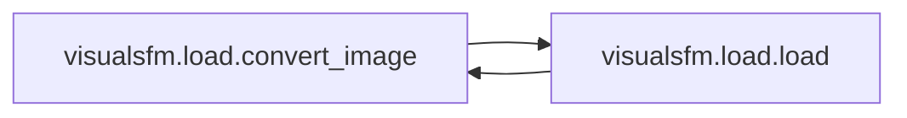
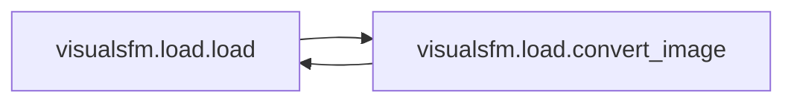

# Visualsfm Load

[_Documentation generated by Documatic_](https://www.documatic.com)

<!---Documatic-section-Codebase Structure-start--->
## Codebase Structure

<!---Documatic-block-system_architecture-start--->
```mermaid
None
```
<!---Documatic-block-system_architecture-end--->

# #
<!---Documatic-section-Codebase Structure-end--->

<!---Documatic-section-visualsfm.load.convert_image-start--->
## [visualsfm.load.convert_image](4-visualsfm_load.md#visualsfm.load.convert_image)

<!---Documatic-section-convert_image-start--->


### Object Calls

* [visualsfm.load.load](4-visualsfm_load.md#visualsfm.load.load)

<!---Documatic-block-visualsfm.load.convert_image-start--->
<details>
	<summary><code>visualsfm.load.convert_image</code> code snippet</summary>

```python
def convert_image(filepath, target):
    sc = bpy.data.scenes.new('photogrammetry_helper')
    try:
        img = bpy.data.images.load(filepath)
        r = sc.render
        r.resolution_x = img.size[0]
        r.resolution_y = img.size[1]
        r.resolution_percentage = floor(100 * min(1.0, 3000 / max(r.resolution_x, r.resolution_y)))
        r.image_settings.file_format = 'JPEG'
        r.image_settings.quality = 100
        sc.display_settings.display_device = 'sRGB'
        img.save_render(target, scene=sc)
        bpy.data.images.remove(img)
    finally:
        bpy.data.scenes.remove(sc)
```
</details>
<!---Documatic-block-visualsfm.load.convert_image-end--->
<!---Documatic-section-convert_image-end--->

# #
<!---Documatic-section-visualsfm.load.convert_image-end--->

<!---Documatic-section-visualsfm.load.load-start--->
## [visualsfm.load.load](4-visualsfm_load.md#visualsfm.load.load)

<!---Documatic-section-load-start--->


### Object Calls

* [visualsfm.load.convert_image](4-visualsfm_load.md#visualsfm.load.convert_image)

<!---Documatic-block-visualsfm.load.load-start--->
<details>
	<summary><code>visualsfm.load.load</code> code snippet</summary>

```python
def load(properties, data, *args, **kwargs):
    dirpath = bpy.path.abspath(properties.dirpath)
    if not dirpath:
        raise AttributeError('VisualSfM Workspace Directory must be provided for output')
    cameras = data['cameras']
    camera_keys = list(cameras.keys())
    trackers = data['trackers']
    if not os.path.exists(dirpath):
        os.makedirs(dirpath)
    for (idx, key) in enumerate(camera_keys):
        camera = cameras[key]
        filepath = camera['filename']
        target = os.path.join(dirpath, os.path.splitext(os.path.basename(filepath))[0] + '.jpg')
        convert_image(filepath, target)
        camera['filename'] = os.path.basename(target)
    with open(os.path.join(dirpath, 'bundle.nvm'), 'w+') as f:
        f.write('NVM_V3\n\n')
        f.write(f'{len(cameras.items())}\n')
        for (idx, key) in enumerate(camera_keys):
            camera = cameras[key]
            R = Matrix(camera['R'])
            R.transpose()
            c = Vector(camera['t'])
            t = -1 * R @ c
            R.transpose()
            R.rotate(Euler((pi, 0, 0)))
            f.write('{filename} {f} {q[0]} {q[1]} {q[2]} {q[3]} {t[0]} {t[1]} {t[2]} {k[0]} 0\n'.format(filename=camera['filename'], f=camera['f'], q=R.to_quaternion(), t=t, k=camera['k']))
        f.write(f'\n{len(trackers.items())}\n')
        sift = 0
        for (tid, track) in trackers.items():
            measurements = {}
            for (cid, camera) in cameras.items():
                if tid in camera['trackers']:
                    measurements.setdefault(cid, camera['trackers'][tid])
            f.write('{co[0]} {co[1]} {co[2]} {rgb[0]} {rgb[1]} {rgb[2]} {num_measurements}'.format(**track, num_measurements=len(measurements.items())))
            for (cid, measurement) in measurements.items():
                f.write(' {image_idx} {feature_idx} {x} {y}'.format(image_idx=cid, feature_idx=sift, x=measurement[0], y=-1 * measurement[1]))
                sift += 1
            f.write('\n')
        f.write('\n\n\n0\n\n')
        f.write('#the last part of NVM file points to the PLY files\n')
        f.write('#the first number is the number of associated PLY files\n')
        f.write('#each following number gives a model-index that has PLY\n')
        f.write('0\n')
```
</details>
<!---Documatic-block-visualsfm.load.load-end--->
<!---Documatic-section-load-end--->

# #
<!---Documatic-section-visualsfm.load.load-end--->

[_Documentation generated by Documatic_](https://www.documatic.com)